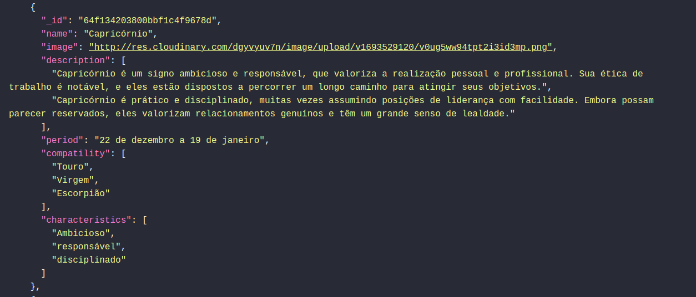

# Signs API

  SignsAPI é a API de consulta de signos, ela foi desenvolvida utilizando o framework Fastify, Typescript, Zod para criação de Schemas e MongoDB com Papr ORM. A aplicação também possui integração com Cloudinary para armazenar imagens, com isso ao cadastrar um novo signo, a imagem
  do signo é hospedada na cloudinary e a url é vinculada ao signo.

## Endpoints

<ul>
  <li>
    GET /signs - Retorna todos os signos
  </li>
  <li>
    GET /signs/:id - Retorna um signo
  </li>
  <li>
    POST /signs - Cria um novo signo
  </li>
  <li>
    PUT /signs/:id - Atualiza um signo
  </li>
  <li>
    DELETE /signs/:id - Deleta um signo
  </li>
</ul>

## Funcionalidades
- [x] Criação, visualização, edição e remoção de signos.
- [x] Integração com Cloudinary.
- [ ] Testes unitários.

## Ferramentas

Ferramentas utilizadas no desenvolvimento.

[@Fastify](https://www.fastify.io/)

[@TypeScript](https://www.typescriptlang.org/)

[@Papr](https://plexinc.github.io/papr/#/)

[@MongoDB](https://www.mongodb.com/atlas/database)
